# CamRaff - Milestone Project 3 - Rogues Den

Here is a link to the deployed site: 

For my third Milestone Project on my course through Code Institute via UCP (University centre Peterborough), I thought it would be fun to create my own version of a Dungeons & Dragons character creation/storage site to allow people to keep track of the characters they have, whether it be few or many! In an ideal world, the site I have created would have the capability to allow for the creation of all race/class combinations, however, in order to ensure I can produce the best project I can within the time I have available, I have chosen to limit the race and class choices to those from the Player's Handbook (2014).

---

# Contents

- [User Experience](#user-experience-ux)

  - [User Stories](#user-stories)

- [Design and Development](#design-and-development)

  - [Wireframes](#wireframes)

    - [Desktop Views](#desktop-views)

    - [Mobile Views](#mobile-views)

  - [Images](#images)

---

# User Experience (UX)

## User Stories

### First Time Visitors

- I am new to Dungeons & Dragons and I want to find a website that will allow me to store my characters from my different campaigns.
- I want to find a website that is straight forward and easy to use. 
- I want to find a website which has a great vibe and cool visuals.

### Returning Visitors

- I want to be able to update my characters as I level up throughout my campaigns.

### Frequent Visitors

- I want to see if there are any new additions to character creation and other features on the site. 

---

# Design and Development

## Wireframes

Below you can find the inital mock-ups for all of the pages for the site on both desktop and mobile. The wireframes were all created using [Balsamiq](https://balsamiq.com/wireframes/).

### Desktop Views

- #### Home Page

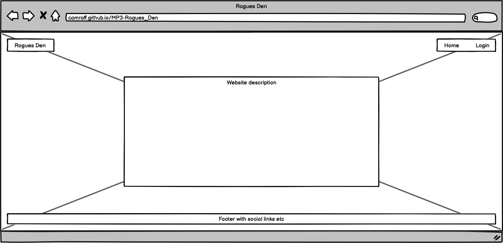

I wanted to keep the home page relatively simple as this is just an introduction, and all of the main focus should be on the character page.

- #### Login/Register Pages

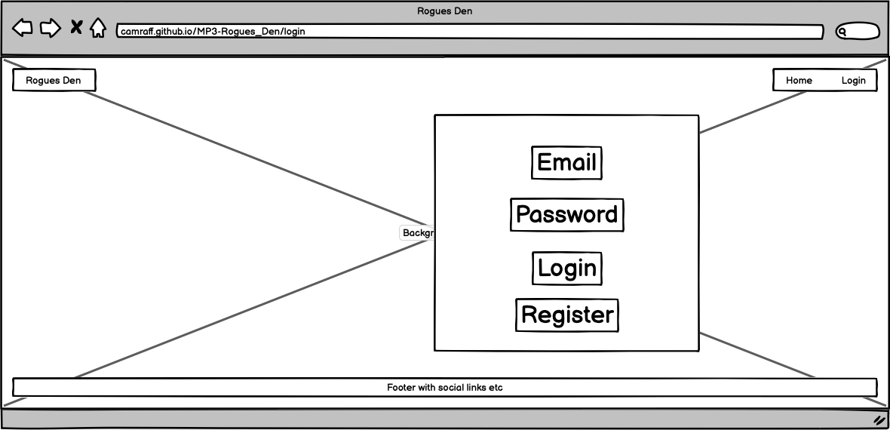

This is the login page which will either log you in or take you to register if not already registered. Clicking log in will take you to the characters page.

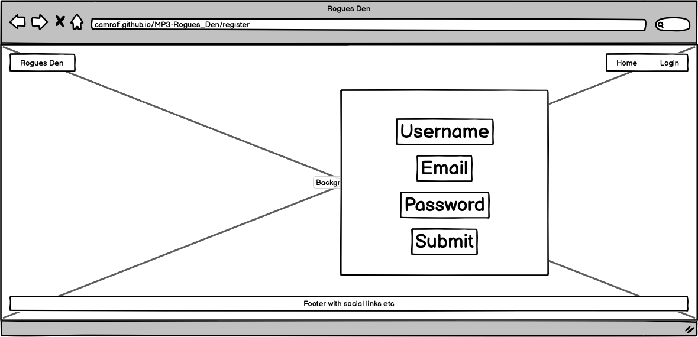

This is the register page, very similar to the login page. Clicking submit will take you to the characters page.

- #### Profile Page

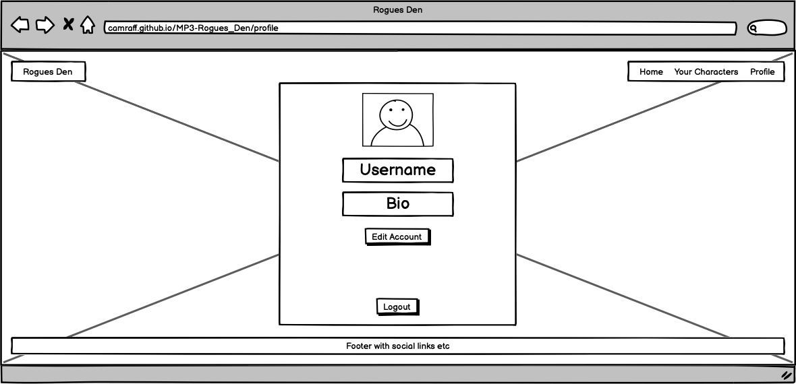

This is the profile page where you can see your details, and from here update them if you wish. This is where you can logout from your account.

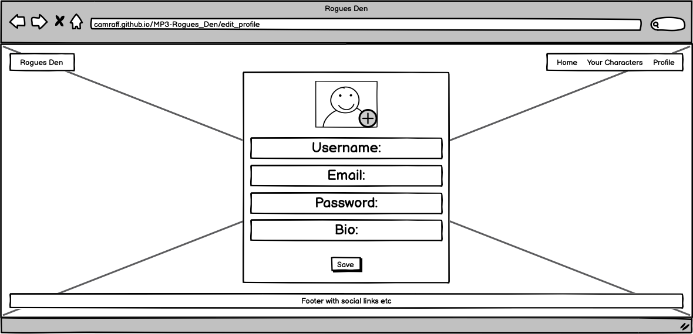

This is a view of the edit account page.

- #### Character Pages

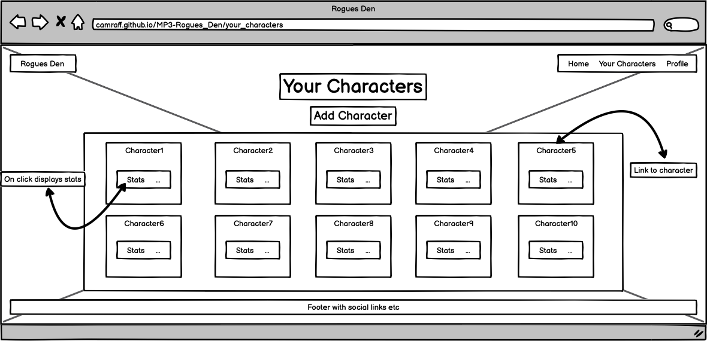

This is the page where all of the users are stored and from here you can create, view, edit and delete the characters you create. The idea is to have the card that is displayed show the character name, an image of the race they picked, and have a drop down to display the stats of their character.

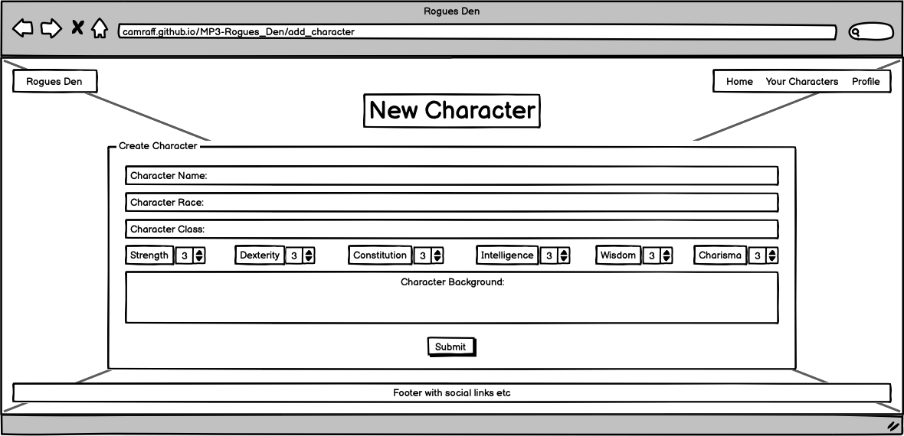

This is the create/add character page, kept relatively simple.

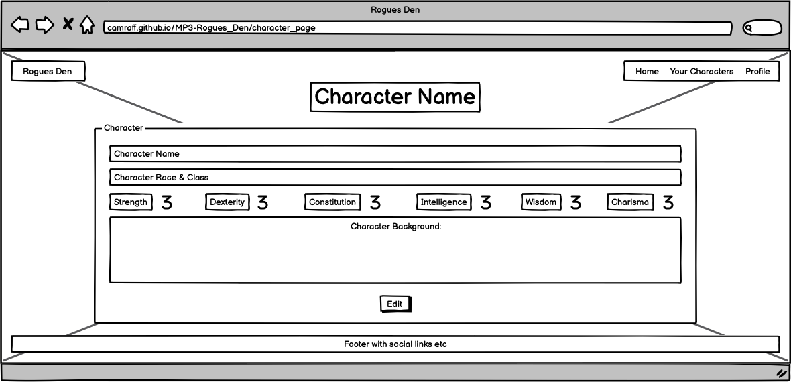

This is how the character will be displayed to the user after they have created them and clicked on the card visible on the character page.

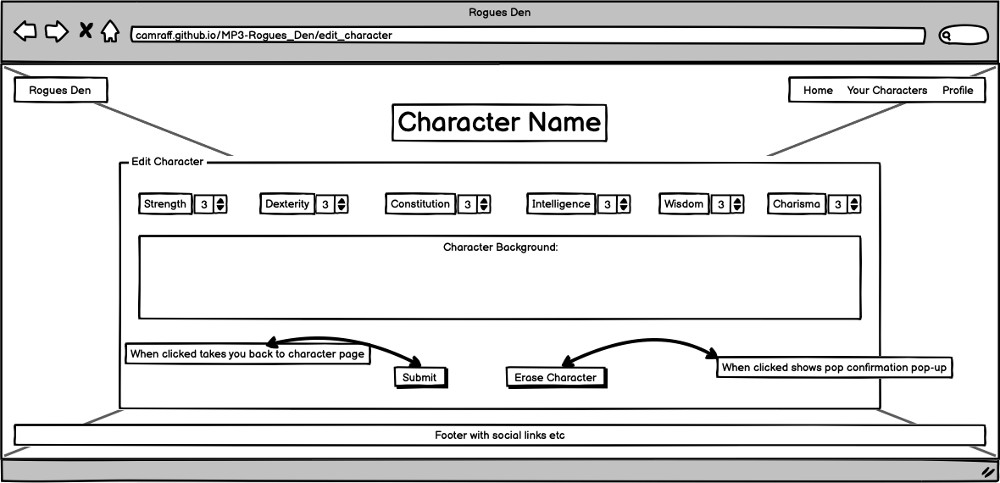

This is the edit character page, very similar to the create/add character page, however the name and race of the character are not changeable once submitted.

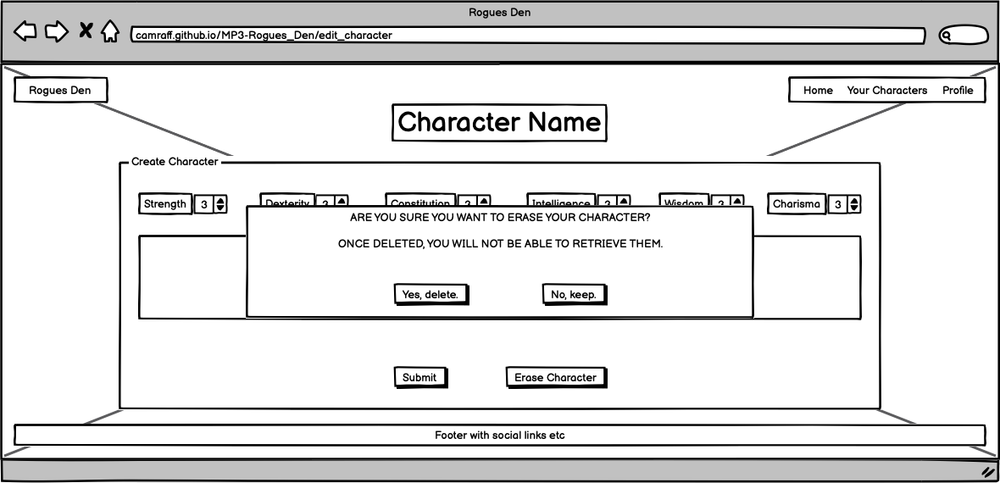

This is the defensive programming pop-up to check if they're sure and to notify them that their decision will be final.

### Mobile Views

- #### Home/Login/Register

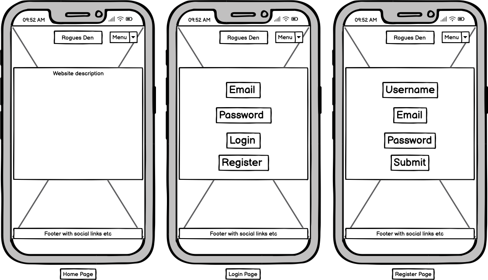

- #### Profile/Edit Profile/Characters

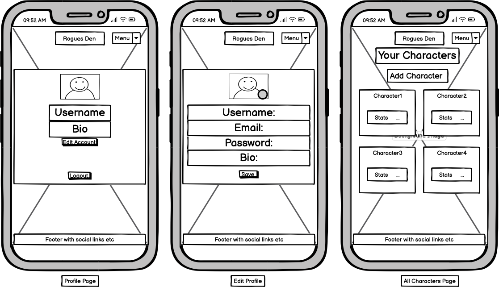

- #### New Character/Character/Edit Character

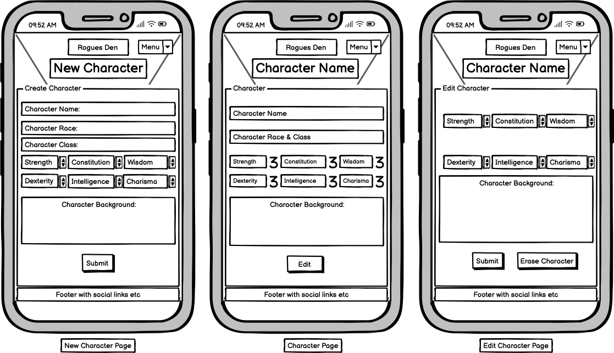

As you can see, the mobile views simply takes the desktop view and translates it more vertical than horizontal. The erase pop-up will appear the same on mobile as on desktop.

## Images

As I have gone with a Dungeons & Dragons style character creation/storage site, I decided for the site background to have a bit of a dark and grungy dungeon/vault style image. The image was created using the prompt "give me an image of a rogue's den" on [ChatGPT](https://chatgpt.com/)

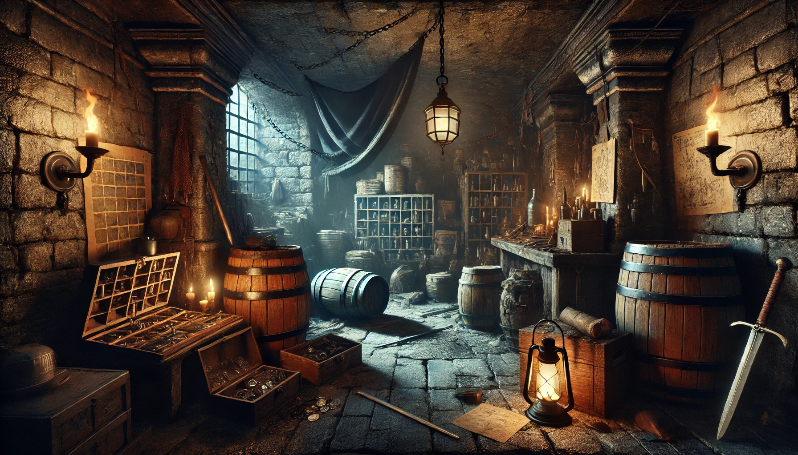

Just incase there were any issues displaying the above image on a smaller device, I also got the below created.

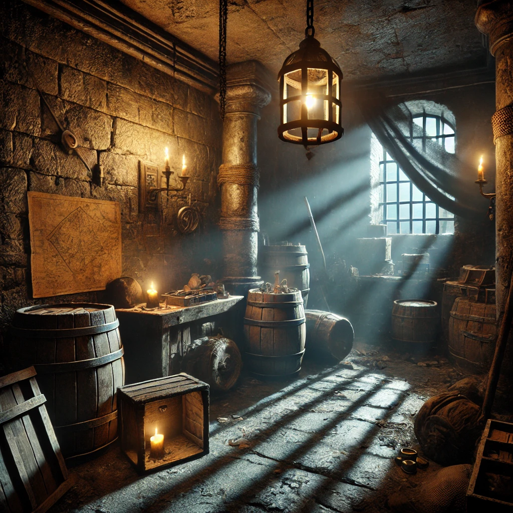